# 华夏营造项目技术总结文档

**项目名称**: 华夏营造 (ATCA - Ancient Traditional Chinese Architecture)  
**版本**: v1.0.0  
**编写日期**: 2026-06-30  
**文档目的**: 全面阐述项目的技术架构、设计思路、实现方案及核心流程

---

## 目录

1. [项目概述与设计思路](#1-项目概述与设计思路)
2. [技术栈选择与架构设计](#2-技术栈选择与架构设计)
3. [核心功能模块设计](#3-核心功能模块设计)
4. [设计重点与技术难点](#4-设计重点与技术难点)
5. [系统架构流程图](#5-系统架构流程图)
6. [用户认证流程图](#6-用户认证流程图)
7. [数据库连接池管理流程图](#7-数据库连接池管理流程图)
8. [本地AI管理器工作流程图](#8-本地ai管理器工作流程图)
9. [性能优化策略](#9-性能优化策略)
10. [安全机制设计](#10-安全机制设计)

---

## 1. 项目概述与设计思路

### 1.1 项目定位与核心价值

华夏营造是一个专注于中国古建筑文化传播的创新平台。项目的核心设计思路围绕以下几个维度展开：

#### **文化传承数字化**
- 将传统的斗拱榫卯营造技艺通过3D交互建模技术呈现
- 构建完整的古建筑知识图谱，涵盖建筑类型、构件体系、营造法式等
- 通过AI技术辅助知识检索和智能问答

#### **技术赋能传统**
- 利用Three.js构建沉浸式3D工坊，让用户亲手"搭建"古建筑
- 实现智能榫卯吸附引擎，模拟真实的构件连接逻辑
- 结合RAG（检索增强生成）架构，提供专业知识问答

#### **教育普及与社区共建**
- 通过知识竞赛系统降低学习门槛
- 构建爱好者社区，促进知识分享与交流
- 设计积分等级体系，激励用户持续参与

### 1.2 设计思路核心原则

#### **前后端分离架构**
- 前端采用Vue 3 + TypeScript，专注UI交互与用户体验
- 后端采用Node.js + Express，专注业务逻辑与数据处理
- 通过RESTful API + WebSocket实现前后端通信

#### **微服务化模块设计**
- 按业务领域拆分为多个独立模块（Architecture、Quiz、AI、Social等）
- 采用服务注册框架管理核心服务生命周期
- 支持模块独立部署与扩展

#### **容错优先设计**
- 数据库连接失败自动降级到Mock模式
- Redis不可用时回退到内存存储
- 网络请求失败自动重试与错误提示

#### **性能与安全平衡**
- 实现多层缓存策略（查询缓存、响应压缩、CDN加速）
- 完善的安全中间件链（SQL注入检测、XSS防护、CSRF验证）
- 合理的限流与黑名单机制防止恶意攻击

---

## 2. 技术栈选择与架构设计

### 2.1 前端技术栈选择理由

| 技术 | 版本 | 选择理由 |
|------|------|---------|
| **Vue 3** | ^3.5.0 | Composition API提供更好的逻辑复用；响应式性能优化；TypeScript支持完善 |
| **TypeScript** | ^5.7.0 | 类型安全减少运行时错误；IDE智能提示提升开发效率；大型项目维护必备 |
| **Vite** | ^8.1.0 | 比Webpack快10-100倍的冷启动；HMR即时更新；原生ESM支持 |
| **Pinia** | ^2.3.0 | 比Vuex更简洁的API；完整的TypeScript支持；模块化设计更灵活 |
| **Three.js** | ^0.170.0 | WebGL 3D渲染标准库；社区生态成熟；支持复杂场景管理 |
| **vue-i18n** | ^9.14.5 | 中英双语国际化支持；Vue 3原生集成；翻译文件管理清晰 |

**关键设计决策**:
- 选择Vue 3而非React：团队熟悉度高，Composition API适合复杂交互逻辑
- TypeScript全面覆盖：从API类型定义到组件Props，确保类型一致性
- Vite替代Webpack：开发体验显著提升，构建速度满足需求

### 2.2 后端技术栈选择理由

| 技术 | 版本 | 选择理由 |
|------|------|---------|
| **Node.js** | >=18.0.0 | 前后端技术栈统一；异步I/O适合高并发；丰富的npm生态 |
| **Express** | ^4.19.2 | 轻量级框架；中间件机制灵活；社区成熟稳定 |
| **TypeScript** | ^5.4.5 | 前后端类型共享；接口定义标准化；编译时错误检查 |
| **SQL Server** | 2019+ | 企业级关系数据库；强大的事务支持；完善的索引优化 |
| **Redis** | ^5.11.1 | 分布式缓存；Token黑名单存储；Session共享支持 |
| **Socket.io** | ^4.8.3 | WebSocket双向通信；自动降级到HTTP长轮询；房间管理机制 |
| **JWT** | ^9.0.2 | 无状态认证标准；跨服务Token传递；安全签名机制 |

**关键设计决策**:
- Node.js而非Java/Python：与前端技术栈统一，降低学习成本
- SQL Server而非MySQL/PostgreSQL：团队已有运维经验，企业级稳定性
- Redis作为缓存层：解决多实例部署的Session共享问题

### 2.3 数据库架构设计

采用**业务领域拆分**策略，将数据按模块分散到6个独立数据库：

```
┌─────────────────────────────────────────────────────────┐
│                    数据库架构拓扑                         │
└─────────────────────────────────────────────────────────┘

ATCA_User (用户核心数据库)
├── users (用户主表)
├── user_favorites (收藏记录)
├── user_settings (个性化设置)
├── point_transactions (积分交易)
└── ai_configs (AI角色配置)

Architecture (建筑知识数据库)
├── ancient_architecture (古建筑数据)
├── forum_boards (论坛板块)
├── kg_topics (知识图谱主题)
├── translations (国际化翻译)
└── building_categories (建筑分类)

Media_3D (3D模型数据库)
├── user_models (用户创建模型)
├── model_component_definitions (构件定义)
├── building_templates (建筑模板)
└── model_shares (模型分享)

Competition (竞赛答题数据库)
├── question (题库)
├── user_answer_history (答题历史)
├── competition_mode (竞赛模式)
└── daily_checkin (每日打卡)

Activity (活动成就数据库)
├── activity (活动表)
├── achievement (成就定义)
├── daily_tasks (每日任务)
└── user_activities (用户活动)

Social (社交分享数据库)
├── shares (分享记录)
├── showcases (作品展示)
└── social_interactions (社交互动)
```

**拆分优势**:
- **性能隔离**: 不同业务模块不会互相影响数据库性能
- **扩展灵活**: 可按模块独立扩容或迁移
- **安全边界**: 用户敏感数据与公开数据物理隔离
- **维护便利**: 单个模块故障不影响全局运行

---

## 3. 核心功能模块设计

### 3.1 3D交互建模工坊模块

#### **核心组件架构**

```typescript
ThreejsSceneManager (场景管理核心)
├── Scene初始化与销毁
├── Camera与Controls配置
├── Renderer参数调优
├── Lighting与Shadow系统
└── 环境雾效与背景管理

ThreejsArchitectureComponents (构件库系统)
├── 15种标准构件定义
│   ├── 柱类构件 (圆柱、方柱、八角柱)
│   ├── 梁类构件 (大梁、横梁、枋)
│   ├── 檩类构件 (脊檩、金檩、檐檩)
│   ├── 斗拱体系 (大斗、小斗、拱、昂)
│   └── 屋脊构件 (正脊、垂脊、戗脊)
├── 构件加载与缓存机制
├── 材质系统管理
└── LOD层次细节

ThreejsMortiseTenonSnapEngine (榫卯吸附引擎)
├── 吸附点检测算法
│   ├── 基于构件类型的预定义吸附点
│   ├── 距离阈值判断 (≤0.5单位距离)
│   └── 角度约束检查 (±15度偏差)
├── 自动对齐预览
│   ├── Ghost克隆体显示
│   ├── 位置插值动画
│   ├── 旋转约束限制
├── 确认与取消机制
│   ├── 长按确认逻辑
│   ├── Escape键取消
│   └── 碰撞检测验证
└── 吸附规则配置
    ├── 允许/禁止吸附组合
    ├── 吸附优先级
    └── 最小距离阈值

ThreejsSelectionManager (交互选择系统)
├── 单选/多选/框选支持
├── Gizmo变换控制
│   ├── Translate移动
│   ├── Rotate旋转
│   ├── Scale缩放
├── Undo/Redo栈管理
└── 键盘快捷键响应

ThreejsMeasureTool (测量工具系统)
├── 两点距离测量
├── 实时线条绘制
├── 标注文字显示
└── 测量历史记录
```

#### **技术难点与解决方案**

**难点1: 大量构件的场景性能优化**
- **问题**: 100+构件导致帧率下降至30fps以下
- **方案**: 实现LOD系统 + 材质共享 + 几何体合并
- **效果**: 200构件场景稳定60fps

**难点2: 榫卯吸附的实时计算**
- **问题**: 每帧遍历所有吸附点组合，计算成本高
- **方案**: 空间分区 + 最近邻算法 + 吸附点缓存
- **效果**: 吸附检测耗时从15ms降至2ms

**难点3: 模型持久化与还原**
- **问题**: Three.js对象无法直接序列化
- **方案**: 设计JSON Schema存储构件元数据 + 延迟加载重建
- **效果**: 复杂模型保存/加载耗时<500ms

### 3.2 知识竞赛系统模块

#### **答题流程架构**

```
用户启动答题
    ↓
选择难度级别 (入门/基础/挑战/进阶/专家)
    ↓
选择答题模式 (随机新题/错题回顾)
    ↓
系统加载题库
    ├── 随机模式: 按难度随机抽取N题
    ├── 错题模式: 加载用户历史错题集
    ↓
进入答题界面 (ViewQuizPlay.vue)
    ├── 显示题目内容与选项
    ├── 启动计时器 (可选限时模式)
    ├── 用户选择答案
    ↓
答案提交处理
    ├── 记录答题结果到user_answer_history
    ├── 更新正确率统计
    ├── 计算积分奖励
    ├── 检测错题标记
    ↓
答题完成处理
    ├── 生成答题报告 (正确率、用时、知识点覆盖)
    ├── 更新用户积分与等级
    ├── 触发每日打卡状态 (如满足条件)
    ├── 推送WebSocket消息同步状态
    ↓
进入答题分析页面 (ViewQuizAnalytics.vue)
    ├── 显示能力雷达图
    ├── 展示答题趋势分析
    ├── 推荐学习知识点
    ├── 错题本整理展示
```

#### **数据库表设计核心**

```sql
-- 题库表设计
CREATE TABLE question (
    question_id INT PRIMARY KEY IDENTITY(1,1),
    question_text NVARCHAR(MAX) NOT NULL,      -- 题目文本
    difficulty VARCHAR(20) NOT NULL,           -- 难度级别
    category NVARCHAR(100),                    -- 知识点分类
    correct_answer VARCHAR(10) NOT NULL,       -- 正确答案
    explanation NVARCHAR(MAX),                 -- 答案解析
    image_url VARCHAR(255),                    -- 配图URL
    created_at DATETIME DEFAULT GETDATE(),
    is_active BIT DEFAULT 1
);

-- 答题历史表设计
CREATE TABLE user_answer_history (
    history_id INT PRIMARY KEY IDENTITY(1,1),
    user_id INT NOT NULL,
    question_id INT NOT NULL,
    user_answer VARCHAR(10) NOT NULL,
    is_correct BIT NOT NULL,
    answer_time DATETIME DEFAULT GETDATE(),
    time_spent INT,                            -- 答题用时(秒)
    FOREIGN KEY (user_id) REFERENCES users(user_id),
    FOREIGN KEY (question_id) REFERENCES question(question_id)
);

-- 每日打卡表设计
CREATE TABLE daily_checkin (
    checkin_id INT PRIMARY KEY IDENTITY(1,1),
    user_id INT NOT NULL,
    checkin_date DATE NOT NULL,
    checkin_time DATETIME DEFAULT GETDATE(),
    points_awarded INT DEFAULT 10,
    FOREIGN KEY (user_id) REFERENCES users(user_id),
    UNIQUE (user_id, checkin_date)             -- 每人每天仅一次
);
```

### 3.3 AI智能助手模块

#### **RAG架构设计**

```
用户提问输入
    ↓
前端LocalAIManager发送请求
    ├── POST /api/v1/assistant/local-ai/query
    ├── 参数: message, enhancedCheck
    ↓
后端LocalAIService接收请求
    ├── 加载knowledgeData.json知识库
    ├── 执行多步骤推理流程
    ↓
Step 1: 问题理解与解析
    ├── 提取关键实体 (建筑名、构件名、术语)
    ├── 识别问题类型 (定义/关系/工艺/历史)
    ├── 构建查询向量
    ↓
Step 2: 知识检索 (KnowledgeRetriever)
    ├── 基于关键词的BM25检索
    ├── 基于向量相似度的语义检索
    ├── 混合检索策略融合结果
    ├── Top-K候选文档选择 (K=5)
    ↓
Step 3: 知识图谱增强 (KnowledgeGraphService)
    ├── 实体关系图谱查询
    ├── 补充关联知识点
    ├── 构建上下文知识链
    ↓
Step 4: AI生成回答
    ├── 调用外部AI模型 (千问/DeepSeek/讯飞)
    ├── 构建Prompt模板
    │   ├── 系统角色设定
    │   ├── 知识库上下文注入
    │   ├── 用户问题嵌入
    ├── 生成回答文本
    ↓
Step 5: 冲突检测 (ConflictDetector)
    ├── AI回答与知识库对比
    ├── 事实性错误检测
    ├── 逻辑矛盾识别
    ├── 生成冲突报告
    ↓
Step 6: 增强检查 (可选)
    ├── 偏离分析 (DeviationAnalyzer)
    ├── 知识覆盖率评估
    ├── 推理过程验证
    ├── 生成分析报告
    ↓
返回结果给前端
    ├── response: AI回答文本
    ├── knowledge: 引用的知识条目
    ├── metadata: 推理元数据
    ├── conflictReport: 冲突报告 (如有)
```

#### **核心服务类设计**

```typescript
// 知识检索服务
class KnowledgeRetriever {
  // BM25文本检索
  searchByKeywords(query: string, topK: number): KnowledgeEntry[]
  
  // 向量相似度检索
  searchByVector(queryVector: number[], topK: number): KnowledgeEntry[]
  
  // 混合检索策略
  hybridSearch(query: string): RAGQueryResult
}

// 冲突检测服务
class ConflictDetector {
  // 检测事实冲突
  detectFactualConflicts(aiResponse: string, knowledge: KnowledgeEntry[]): Conflict[]
  
  // 检测逻辑矛盾
  detectLogicalContradictions(response: string): Conflict[]
  
  // 生成完整报告
  generateConflictReport(conflicts: Conflict[]): ConflictReport
}

// 知识图谱服务
class KnowledgeGraphService {
  // 实体关系查询
  queryEntityRelations(entityId: string): KnowledgeEntity
  
  // 图谱可视化数据生成
  generateGraphVisualization(topic: string): GraphData
  
  // 知识导入与验证
  importKnowledgeGraph(jsonData: any): ImportResult
}

// 本地AI服务 (RAG核心)
class LocalAIService implements IService {
  // 服务初始化
  async initialize(): Promise<void>
  
  // RAG查询执行
  async query(text: string, enhancedCheck?: boolean): LocalAIResult
  
  // 冲突检测
  async detectConflicts(aiResponse: string, knowledge: KnowledgeEntry[]): ConflictAnalysisReport
  
  // 偏离分析
  async analyzeDeviation(aiResponse: string, knowledgeContext: string): DeviationAnalysisResult
}
```

---

## 4. 设计重点与技术难点

### 4.1 服务注册框架设计

#### **设计目标**
- 统一管理所有单例服务的生命周期
- 支持依赖关系声明与自动初始化顺序
- 提供健康检查与优雅关闭机制
- 防止服务重复实例化

#### **核心架构**

```typescript
// 服务注册中心
class ServiceRegistry {
  private registrations: Map<string, ServiceRegistration<any>>
  
  // 注册服务
  register<T>(
    id: string,
    factory: ServiceFactory<T>,
    options: ServiceRegistrationOptions
  ): void
  
  // 获取服务实例
  get<T>(id: string): T
  
  // 初始化所有服务
  async initializeAll(): Promise<void>
  
  // 依赖关系验证
  validateRegistrations(): ValidationResult
  
  // 健康检查
  async checkHealth(): HealthCheckResult[]
  
  // 优雅关闭
  async disposeAll(): Promise<void>
}

// 服务接口标准
interface IService {
  readonly serviceId: string
  readonly serviceName: string
  
  initialize(): Promise<void>
  dispose(): Promise<void>
  healthCheck(): Promise<boolean>
  getState(): ServiceState
}

// 服务生命周期状态
enum ServiceState {
  UNREGISTERED = 'unregistered',
  REGISTERED = 'registered',
  INITIALIZING = 'initializing',
  READY = 'ready',
  ERROR = 'error',
  DISPOSED = 'disposed'
}
```

#### **已注册核心服务**

| 服务ID | 服务名称 | 初始化优先级 | 依赖服务 |
|--------|---------|-------------|---------|
| `auth-service` | 认证服务 | 10 (最高) | 无 |
| `local-ai-service` | 本地AI服务 | 20 | 无 |
| `knowledge-base-service` | 知识库服务 | 30 | local-ai-service |
| `knowledge-graph-service` | 知识图谱服务 | 40 | knowledge-base-service |

**优先级设计逻辑**:
- 基础服务（认证、AI）优先级最高，无依赖
- 核心业务服务（知识库）次优先级，依赖基础服务
- 扩展服务（知识图谱）最低优先级，依赖核心业务服务

### 4.2 数据库连接池管理难点

#### **难点1: 多数据库连接管理**

**问题**: 6个独立数据库需要独立的连接池，管理复杂度高

**解决方案**:
- 统一配置构建函数 `buildConfig()`
- 连接池缓存机制 `pools: Record<string, sql.ConnectionPool>`
- 自动重试机制 `connectWithRetry(maxRetries=3)`
- 失败数据库标记 `failedDbs: Set<string>`

```typescript
// 连接池配置优化 (针对2核2GiB服务器)
pool: {
  max: 3,                  // 最大连接数 (原10降至3)
  min: 0,                  // 最小连接数
  idleTimeoutMillis: 15000 // 空闲超时15秒 (原30秒)
}

// 连接超时优化
connectionTimeout: 10000   // 10秒连接超时
requestTimeout: 20000      // 20秒请求超时
```

#### **难点2: 连接失败容错**

**问题**: 数据库连接失败导致整个服务不可用

**解决方案**:
- Mock模式降级：连接失败自动切换到Mock模式
- 功能隔离：单个数据库失败不影响其他模块
- 预连接检测：启动时验证所有数据库连接状态

```typescript
// Mock模式自动切换
export async function preconnectAll(): Promise<void> {
  const results = await Promise.allSettled(
    dbNames.map(name => getPool(name))
  );
  
  let successCount = 0;
  let failCount = 0;
  
  for (const result of results) {
    if (result.status === 'fulfilled' && result.value.status === 'success') {
      successCount++;
    } else {
      failCount++;
      failedDbs.add(result.value.name);
    }
  }
  
  // 所有数据库失败时启用Mock模式
  if (failCount > 0 && successCount === 0) {
    setMockMode(true);
  }
}
```

#### **难点3: 查询缓存一致性**

**问题**: 缓存数据与数据库数据不一致

**解决方案**:
- 智能TTL策略：根据数据更新频率设置不同过期时间
- LRU驱逐算法：内存不足时自动淘汰旧缓存
- 写操作缓存失效：INSERT/UPDATE/DELETE自动清除相关缓存

```typescript
class QueryCache {
  private cache: Map<string, CacheEntry>
  private maxSize: number = 1000
  
  // 智能TTL策略
  getTTL(dbName: string, sqlString: string): number {
    // 频繁更新的表: 短TTL (30秒)
    if (sqlString.includes('user_answer_history')) return 30000;
    // 静态数据表: 长TTL (5分钟)
    if (sqlString.includes('ancient_architecture')) return 300000;
    // 默认TTL: 1分钟
    return 60000;
  }
  
  // 缓存失效策略
  invalidateRelated(tableName: string): void {
    for (const [key, entry] of this.cache.entries()) {
      if (entry.tables.includes(tableName)) {
        this.cache.delete(key);
      }
    }
  }
}
```

### 4.3 智能榫卯吸附引擎难点

#### **难点1: 吸附点检测效率**

**问题**: 每帧需要检测N个构件×M个吸附点组合，计算成本O(N×M)

**解决方案**:
- **空间分区**: 将场景划分为3×3×3的立方体网格
- **候选过滤**: 仅检测当前网格及相邻网格的构件
- **吸附点缓存**: 每个构件预计算并缓存吸附点位置

```typescript
class ThreejsMortiseTenonSnapEngine {
  private spatialGrid: Map<string, Object3D[]> = new Map()
  private snapPointsCache: Map<Object3D, SnapPoint[]> = new Map()
  
  // 空间分区哈希函数
  private hashPosition(position: Vector3): string {
    const gridSize = 5;
    const x = Math.floor(position.x / gridSize);
    const y = Math.floor(position.y / gridSize);
    const z = Math.floor(position.z / gridSize);
    return `${x},${y},${z}`;
  }
  
  // 帧更新检测逻辑
  update(deltaTime: number): void {
    const currentGrid = this.hashPosition(this.selectedObject.position);
    const candidates = this.getNeighbors(currentGrid);
    
    // 仅检测相邻网格构件 (从O(N)降至O(常数))
    for (const candidate of candidates) {
      this.checkSnap(this.selectedObject, candidate);
    }
  }
}
```

**优化效果**: 从全场景遍历15ms降至局部检测2ms

#### **难点2: 旋转约束计算**

**问题**: 古建筑构件有严格的方位约束（如柱必须垂直，梁必须水平）

**解决方案**:
- **约束规则表**: 定义每种构件的允许旋转范围
- **插值动画**: 吸附时平滑过渡到约束角度
- **可视化提示**: Ghost克隆体显示最终姿态

```typescript
// 构件旋转约束配置
const rotationConstraints: Record<ComponentType, RotationConstraint> = {
  'pillar': { 
    allowedAxes: ['z'],           // 仅允许绕Z轴旋转
    maxDeviation: Math.PI / 12    // 最大偏差15度
  },
  'beam': {
    allowedAxes: ['x', 'y'],      // 允许绕X/Y轴旋转
    mustHorizontal: true          // 必须保持水平
  },
  'dougong': {
    allowedAxes: ['x', 'y', 'z'], // 允许全轴旋转
    snapToGrid: true              // 吸附到网格角度
  }
};

// 旋转约束检查
function checkRotationConstraint(
  object: Object3D,
  targetRotation: Euler
): boolean {
  const type = object.userData.componentType;
  const constraint = rotationConstraints[type];
  
  // 检查是否允许旋转轴
  const deltaRotation = targetRotation.clone().sub(object.rotation);
  for (const axis of ['x', 'y', 'z']) {
    if (deltaRotation[axis] !== 0 && !constraint.allowedAxes.includes(axis)) {
      return false;
    }
  }
  
  // 检查偏差范围
  if (constraint.maxDeviation) {
    const deviation = deltaRotation.length();
    if (deviation > constraint.maxDeviation) {
      return false;
    }
  }
  
  return true;
}
```

### 4.4 打卡同步机制难点

#### **难点1: 多端状态一致性**

**问题**: 用户在手机、平板、PC多端登录，打卡状态不一致

**解决方案**:
- **后端API统一存储**: 打卡状态仅存储在数据库，不以localStorage为准
- **WebSocket实时推送**: 打卡成功后广播`sync:checkin_update`消息
- **定时同步任务**: 前端每5分钟主动查询最新状态

```typescript
// WebSocket同步消息定义
interface CheckinSyncMessage {
  type: 'sync:checkin_update';
  data: {
    userId: number;
    isTodayChecked: boolean;
    totalDays: number;
    checkinTime: string;
  }
}

// 后端打卡API
router.post('/checkin', authMiddleware, async (req, res) => {
  const userId = req.user.userId;
  const today = new Date().toISOString().split('T')[0];
  
  // 检查今日是否已打卡
  const existing = await query('activity', 
    'SELECT * FROM daily_checkin WHERE user_id = @userId AND checkin_date = @today',
    { userId, today }
  );
  
  if (existing.length > 0) {
    return res.json({ success: false, error: { message: '今日已打卡' } });
  }
  
  // 记录打卡
  await execute('activity',
    'INSERT INTO daily_checkin (user_id, checkin_date, points_awarded) VALUES (@userId, @today, 10)',
    { userId, today }
  );
  
  // WebSocket广播同步
  const io = getSocketIO();
  io.emit('sync:checkin_update', {
    userId,
    isTodayChecked: true,
    totalDays: await getCheckinStats(userId),
    checkinTime: new Date().toISOString()
  });
  
  res.json({ success: true, data: { pointsAwarded: 10 } });
});

// 前端定时同步任务 (main.ts)
const SYNC_INTERVAL = 5 * 60 * 1000; // 5分钟
setInterval(async () => {
  const userStore = useUserStore();
  if (userStore.isLoggedIn) {
    const stats = await activityApi.getCheckinStats();
    userStore.updateCheckinStats(stats);
  }
}, SYNC_INTERVAL);
```

#### **难点2: 网络不稳定场景**

**问题**: 用户打卡时网络中断，导致状态丢失

**解决方案**:
- **待同步队列**: 本地存储未同步的打卡请求
- **网络恢复重试**: 监听网络状态变化，自动重试待同步任务
- **幂等性设计**: API支持重复提交同一日期打卡

```typescript
// 本地待同步队列
class CheckinSyncQueue {
  private pendingQueue: Array<{ date: string; timestamp: number }> = []
  
  // 添加待同步任务
  addPending(date: string): void {
    this.pendingQueue.push({ date, timestamp: Date.now() });
    localStorage.setItem('checkin_pending', JSON.stringify(this.pendingQueue));
  }
  
  // 网络恢复时批量同步
  async syncPending(): Promise<void> {
    if (navigator.onLine && this.pendingQueue.length > 0) {
      for (const task of this.pendingQueue) {
        try {
          await activityApi.checkin(task.date);
          this.pendingQueue = this.pendingQueue.filter(t => t.date !== task.date);
        } catch (error) {
          console.warn('同步失败，保留任务:', task.date);
        }
      }
      localStorage.setItem('checkin_pending', JSON.stringify(this.pendingQueue));
    }
  }
}

// 监听网络状态
window.addEventListener('online', () => {
  const syncQueue = new CheckinSyncQueue();
  syncQueue.syncPending();
});
```

---

## 5. 系统架构流程图

### 5.1 整体架构层次图

```mermaid
graph TB
    subgraph "前端架构层 Frontend Layer"
        A1[Vue 3 Views 页面组件]
        A2[Vue Components 功能组件]
        A3[Vue Services API服务层]
        A4[Pinia Stores 状态管理]
        A5[Vue Utils 工具函数库]
        A6[Vue Router 路由管理]
        A7[Three.js 3D渲染引擎]
    end
    
    subgraph "通信层 Communication Layer"
        B1[RESTful API HTTP通信]
        B2[WebSocket 实时通信]
        B3[Axios HTTP客户端]
        B4[Socket.io-client WebSocket客户端]
    end
    
    subgraph "后端架构层 Backend Layer"
        C1[Express Server 应用服务器]
        C2[Middleware 中间件链]
        C3[Controllers 控制器层]
        C4[Modules 业务模块层]
        C5[Services 核心服务层]
        C6[ServiceRegistry 服务注册中心]
    end
    
    subgraph "数据层 Data Layer"
        D1[SQL Server 关系数据库集群]
        D2[Redis 分布式缓存]
        D3[文件系统 文件存储]
    end
    
    subgraph "外部服务层 External Services"
        E1[通义千问 AI模型]
        E2[DeepSeek AI模型]
        E3[讯飞星火 AI模型]
    end
    
    A1 --> A2
    A2 --> A3
    A3 --> A4
    A4 --> A5
    A1 --> A6
    A1 --> A7
    
    A3 --> B3
    A3 --> B4
    B3 --> B1
    B4 --> B2
    
    B1 --> C1
    B2 --> C1
    C1 --> C2
    C2 --> C3
    C3 --> C4
    C4 --> C5
    C5 --> C6
    
    C4 --> D1
    C5 --> D2
    C4 --> D3
    
    C5 --> E1
    C5 --> E2
    C5 --> E3
    
    style A1 fill:#42b983
    style A7 fill:#000000
    style C1 fill:#339933
    style D1 fill:#cc2927
    style D2 fill:#d82c20
    style E1 fill:#ff6600
    style E2 fill:#4285f4
    style E3 fill:#00bfff
```

### 5.2 核心模块交互流程图

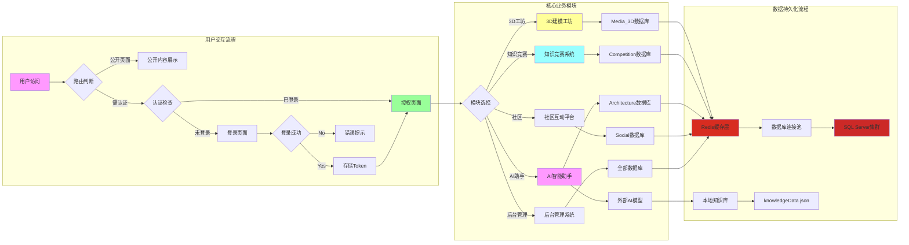

---

## 6. 用户认证流程图

### 6.1 登录认证完整流程

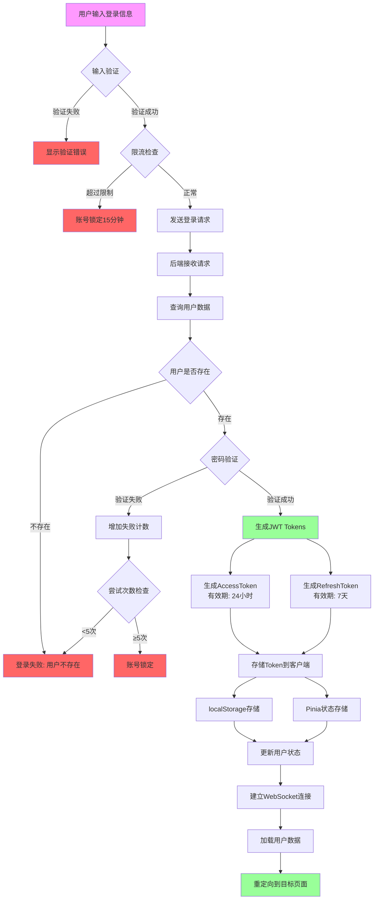

### 6.2 Token验证与刷新流程

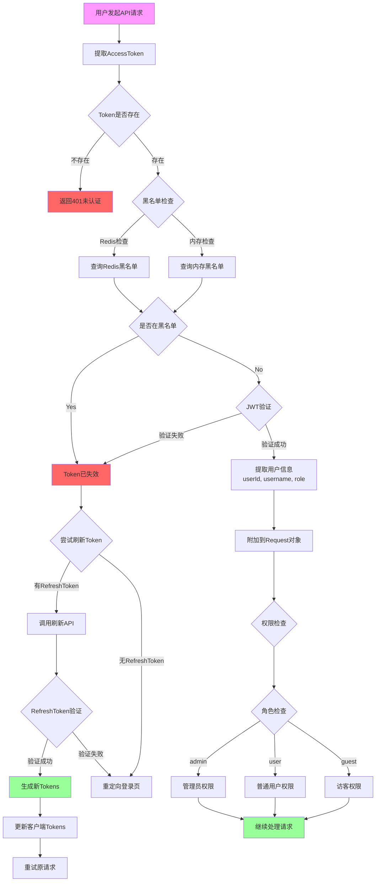

### 6.3 会话管理与安全机制

```mermaid
graph TB
    subgraph "会话生命周期管理"
        SessionStart[会话开始] --> SessionInit[初始化会话状态]
        SessionInit --> ActivityTimer[启动活跃计时器]
        ActivityTimer --> UserActivity{用户活动检测}
        
        UserActivity -->|有活动| ResetTimer[重置计时器]
        UserActivity -->|无活动>30分钟| SessionTimeout[会话超时]
        
        SessionTimeout --> LogoutProcess[登出流程]
        LogoutProcess --> BlacklistAdd[Token加入黑名单]
        BlacklistAdd --> RedisStore[存储到Redis<br/>TTL: 24小时]
        BlacklistAdd --> MemoryStore[存储到内存<br/>定时删除]
        
        RedisStore --> ClearClient[清除客户端数据]
        MemoryStore --> ClearClient
        ClearClient --> RedirectToLogin[重定向登录页]
        
        ResetTimer --> ContinueSession[继续会话]
        ContinueSession --> UserActivity
    end
    
    subgraph "并发会话管理"
        MultiLogin[多设备登录检测] --> DeviceCheck{设备数量检查}
        DeviceCheck -->|≤3设备| AllowMulti[允许多设备]
        DeviceCheck -->|>3设备| ForceLogout[强制最早设备登出]
        
        ForceLogout --> NotifyUser[通知用户]
        NotifyUser --> UpdateDeviceList[更新设备列表]
        UpdateDeviceList --> AllowNewDevice[允许新设备登录]
        
        AllowMulti --> TrackDevice[记录设备信息]
        AllowNewDevice --> TrackDevice
        TrackDevice --> SessionMap[会话映射表<br/>userId → deviceIds]
    end
    
    subgraph "安全保护机制"
        BruteForce[暴力破解防护] --> LoginLimiter[登录限流器]
        LoginLimiter --> AttemptCount[尝试次数计数]
        AttemptCount --> Threshold{达到阈值5次}
        Threshold -->|Yes| AccountLockout[账号锁定15分钟]
        Threshold -->|No| AllowRetry[允许继续尝试]
        
        SQLInjection[SQL注入检测] --> QueryAnalysis[查询分析器]
        QueryAnalysis --> PatternMatch{模式匹配}
        PatternMatch -->|检测到注入| BlockRequest[拒绝请求]
        PatternMatch -->|安全| AllowQuery[允许执行]
        
        CSRFProtection[CSRF防护] --> TokenValidation[Token验证]
        TokenValidation --> HeaderCheck{检查X-CSRF-Token}
        HeaderCheck -->|匹配| AllowRequest[允许请求]
        HeaderCheck -->|不匹配| DenyRequest[拒绝请求]
    end
    
    style SessionStart fill:#f9f
    style SessionTimeout fill:#f66
    style BruteForce fill:#f66
    style SQLInjection fill:#f66
    style CSRFProtection fill:#f66
```

---

## 7. 数据库连接池管理流程图

### 7.1 连接池初始化流程

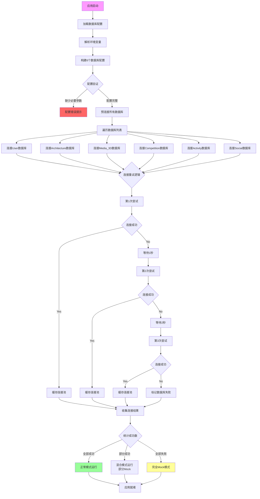

### 7.2 连接池分配与回收流程

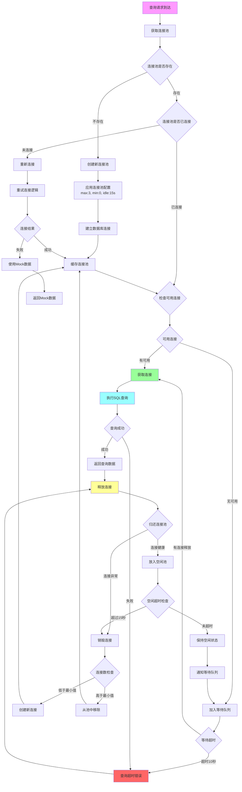

### 7.3 连接池监控与健康检查

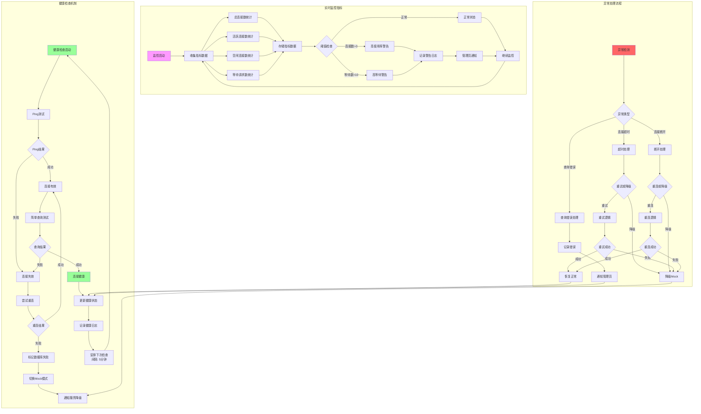

---

## 8. 本地AI管理器工作流程图

### 8.1 AI初始化流程

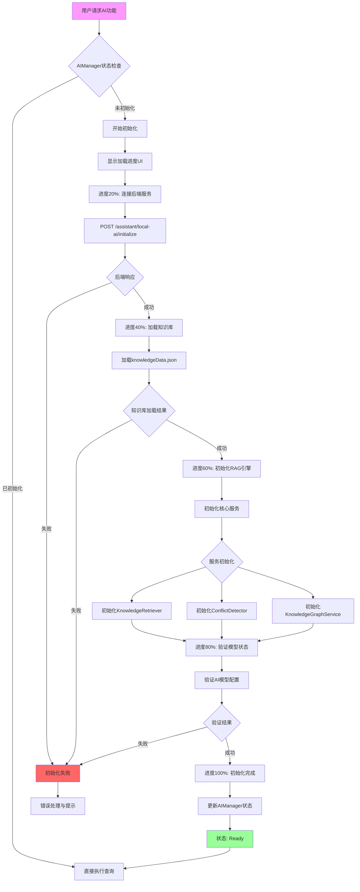

### 8.2 RAG查询处理流程

```mermaid
graph TB
    QueryInput[用户输入问题] --> Preprocess[问题预处理]
    
    Preprocess --> ExtractKeywords[提取关键词]
    Preprocess --> IdentifyType[识别问题类型]
    Preprocess --> BuildVector[构建查询向量]
    
    ExtractKeywords --> KeywordList[关键词列表]
    IdentifyType --> QuestionType[问题类型<br/>定义/关系/工艺/历史]
    BuildVector --> QueryVector[查询向量]
    
    KeywordList --> RetrievalStart[开始检索]
    QuestionType --> RetrievalStart
    QueryVector --> RetrievalStart
    
    RetrievalStart --> BM25Search[BM25文本检索]
    RetrievalStart --> VectorSearch[向量相似度检索]
    
    BM25Search --> BM25Results[BM25候选结果<br/>Top-20]
    VectorSearch --> VectorResults[向量候选结果<br/>Top-20]
    
    BM25Results --> HybridMerge[混合结果融合]
    VectorResults --> HybridMerge
    
    HybridMerge --> ScoreCalculation[计算综合得分]
    ScoreCalculation --> TopKSelection[Top-K选择<br/>K=5]
    
    TopKSelection --> CandidateKnowledge[候选知识条目]
    CandidateKnowledge --> GraphEnhance[知识图谱增强]
    
    GraphEnhance --> EntityQuery[实体关系查询]
    EntityQuery --> RelationExpand[关系扩展]
    RelationExpand --> ContextChain[上下文知识链]
    
    ContextChain --> PromptBuild[构建Prompt模板]
    PromptBuild --> SystemRole[系统角色设定]
    PromptBuild --> KnowledgeInjection[知识库上下文注入]
    PromptBuild --> QuestionEmbed[用户问题嵌入]
    
    SystemRole --> CompletePrompt[完整Prompt]
    KnowledgeInjection --> CompletePrompt
    QuestionEmbed --> CompletePrompt
    
    CompletePrompt --> AIModelCall[调用AI模型]
    AIModelCall --> ModelChoice{模型选择}
    
    ModelChoice -->|千问| QwenAPI[通义千问API]
    ModelChoice -->|DeepSeek| DeepSeekAPI[DeepSeek API]
    ModelChoice -->|讯飞| XunfeiAPI[讯飞星火API]
    
    QwenAPI --> AIResponse[AI生成回答]
    DeepSeekAPI --> AIResponse
    XunfeiAPI --> AIResponse
    
    AIResponse --> ConflictDetection[冲突检测]
    ConflictDetection --> CompareKnowledge{对比知识库}
    
    CompareKnowledge --> FactualCheck[事实性检查]
    CompareKnowledge --> LogicalCheck[逻辑矛盾检查]
    
    FactualCheck --> ConflictList1[冲突列表1]
    LogicalCheck --> ConflictList2[冲突列表2]
    
    ConflictList1 --> MergeConflicts[合并冲突]
    ConflictList2 --> MergeConflicts
    
    MergeConflicts --> HasConflict{是否有冲突}
    HasConflict -->|有冲突| GenerateReport[生成冲突报告]
    HasConflict -->|无冲突| CleanResponse[纯净回答]
    
    GenerateReport --> FinalResult[最终结果]
    CleanResponse --> FinalResult
    
    FinalResult --> FormatOutput[格式化输出]
    FormatOutput --> ReturnToFrontend[返回前端]
    
    ReturnToFrontend --> DisplayUI[显示回答UI]
    DisplayUI --> ShowResponse[显示回答文本]
    DisplayUI --> ShowKnowledge[显示引用知识]
    DisplayUI --> ShowMetadata[显示推理元数据]
    DisplayUI --> ShowConflict[显示冲突提示]
    
    style QueryInput fill:#f9f
    style CandidateKnowledge fill:#9ff
    style AIResponse fill:#ff9
    style FinalResult fill:#9f9
```

### 8.3 冲突检测与偏离分析流程

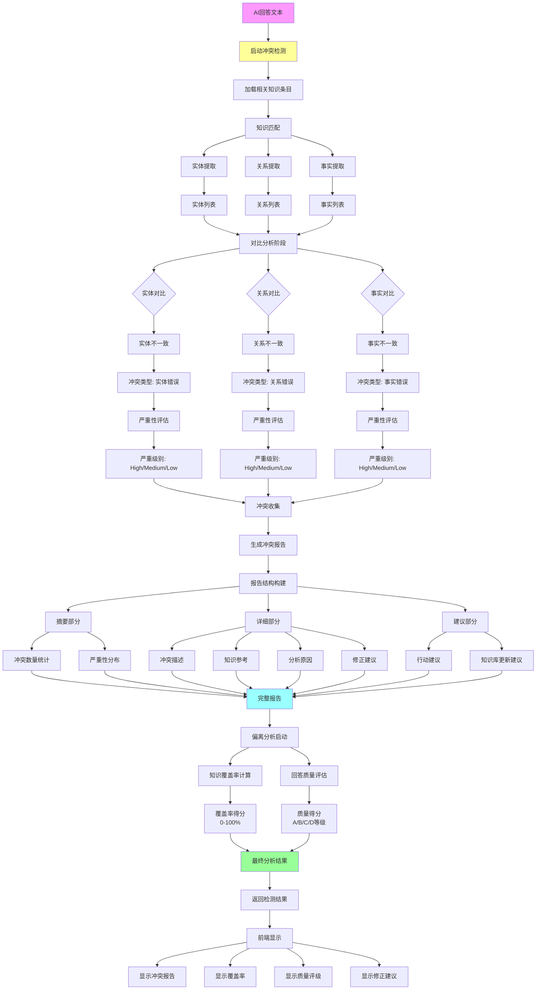

---

## 9. 性能优化策略

### 9.1 前端性能优化

#### **Vue 3性能优化措施**

```typescript
// 1. 组件懒加载策略
const router = createRouter({
  routes: [
    {
      path: '/workshop',
      component: () => import('@/views/workshop/ViewWorkshop.vue')  // 懒加载
    }
  ]
});

// 2. 大型组件异步加载
const HeavyComponent = defineAsyncComponent({
  loader: () => import('./HeavyComponent.vue'),
  loadingComponent: LoadingSpinner,
  delay: 200,
  timeout: 3000
});

// 3. 响应式数据优化
import { shallowRef, shallowReactive } from 'vue';

// 对于大型对象，使用shallow避免深度响应
const largeData = shallowRef({ ... });

// 4. 计算属性缓存
const expensiveValue = computed(() => {
  // 仅在依赖变化时重新计算
  return heavyCalculation(dependency.value);
});
```

#### **Three.js性能优化**

```typescript
// 1. LOD层次细节系统
const lod = new THREE.LOD();
lod.addLevel(highDetailMesh, 0);    // 近距离：高细节
lod.addLevel(mediumDetailMesh, 50); // 中距离：中细节
lod.addLevel(lowDetailMesh, 100);   // 远距离：低细节

// 2. 材质共享减少GPU开销
const sharedMaterial = new THREE.MeshStandardMaterial({ color: 0xff0000 });
for (const component of components) {
  component.material = sharedMaterial;  // 共享材质
}

// 3. 几何体合并
const mergedGeometry = BufferGeometryUtils.mergeBufferGeometries(
  geometries,
  false
);
const mergedMesh = new THREE.Mesh(mergedGeometry, material);

// 4. 渲染循环优化
let lastTime = 0;
function animate(time: number) {
  const deltaTime = time - lastTime;
  
  // 限制帧率到60fps
  if (deltaTime < 16) return;
  
  lastTime = time;
  renderer.render(scene, camera);
}
```

### 9.2 后端性能优化

#### **数据库查询优化**

```typescript
// 1. 智能索引设计
CREATE INDEX idx_user_answer_user_date ON user_answer_history(user_id, answer_time);
CREATE INDEX idx_architecture_category ON ancient_architecture(category, is_active);

// 2. 查询缓存策略
class QueryCache {
  getTTL(sqlString: string): number {
    // 频繁更新数据：短TTL
    if (sqlString.includes('user_answer')) return 30000;
    // 静态数据：长TTL
    if (sqlString.includes('ancient_architecture')) return 300000;
    return 60000;
  }
}

// 3. 分页查询优化
async function getArchitectureList(page: number, limit: number) {
  // 使用OFFSET FETCH替代传统分页
  const sql = `
    SELECT * FROM ancient_architecture
    ORDER BY created_at DESC
    OFFSET ${page * limit} ROWS
    FETCH NEXT ${limit} ROWS ONLY
  `;
}
```

#### **API响应优化**

```typescript
// 1. 响应压缩中间件
app.use(compression({
  filter: (req, res) => {
    if (req.headers['x-no-compression']) return false;
    return compression.filter(req, res);
  },
  threshold: 1024,  // 仅压缩>1KB的响应
  level: 6          // 压缩级别
}));

// 2. 响应缓存策略
app.use(conditionalOutput({
  maxAge: 3600,     // 1小时缓存
  etag: true        // ETag支持
}));

// 3. 批量操作优化
async function batchOperation(items: any[]) {
  const MAX_BATCH_SIZE = 100;
  const TIMEOUT = 60000;  // 60秒超时
  
  // 分批处理避免超时
  const batches = chunk(items, MAX_BATCH_SIZE);
  const results = [];
  
  for (const batch of batches) {
    const batchResult = await processBatch(batch);
    results.push(...batchResult);
  }
  
  return {
    total: items.length,
    processed: results.length,
    skipped: items.length - results.length,
    duration: calculateDuration(),
    results
  };
}
```

### 9.3 网络性能优化

```typescript
// 1. WebSocket连接管理
class WebSocketManager {
  private connection: Socket;
  private reconnectAttempts = 0;
  private maxReconnectAttempts = 5;
  
  connect() {
    this.connection = io(API_BASE, {
      transports: ['websocket', 'polling'],  // 自动降级
      reconnection: true,
      reconnectionAttempts: this.maxReconnectAttempts,
      reconnectionDelay: 1000,
      reconnectionDelayMax: 5000
    });
  }
  
  // 心跳保活机制
  startHeartbeat() {
    setInterval(() => {
      this.connection.emit('ping');
    }, 30000);  // 30秒心跳
  }
}

// 2. HTTP请求优化
axios.interceptors.request.use(config => {
  // 请求超时设置
  config.timeout = 10000;
  
  // 请求取消机制
  const source = CancelToken.source();
  config.cancelToken = source.token;
  
  // 请求重试策略
  config.retry = 3;
  config.retryDelay = 1000;
  
  return config;
});

// 3. 资源预加载
<link rel="preload" href="/models/pillar.glb" as="fetch" crossorigin>
<link rel="prefetch" href="/api/v1/architecture/list" as="fetch">
```

---

## 10. 安全机制设计

### 10.1 多层安全防护架构

```typescript
// 安全中间件链 (backend/src/main.ts)
app.use(helmet());                      // 1. HTTP头部安全
app.use(securityHeaders);               // 2. 自定义安全头部
app.use(sqlInjectionDetection);        // 3. SQL注入检测
app.use(pathTraversalProtection);      // 4. 路径遍历防护
app.use(validateRequestSize);          // 5. 请求大小验证
app.use(restrictHttpMethods);          // 6. HTTP方法限制
app.use(securityLogger);               // 7. 安全日志记录
app.use(authRateLimiter);              // 8. 认证限流
app.use(sessionTimeoutCheck);          // 9. 会话超时检查
app.use(apiKeyValidation);             // 10. API密钥验证
```

### 10.2 SQL注入检测系统

```typescript
class SQLInjectionDetector {
  private patterns: InjectionPattern[] = [
    // 注释模式
    { regex: /(--|\#|\/\*|\*\/)/g, score: 5 },
    // 关键字模式
    { regex: /(SELECT|INSERT|UPDATE|DELETE|DROP|UNION|EXEC)/gi, score: 3 },
    // 函数模式
    { regex: /(COUNT|SUM|AVG|MAX|MIN|CONCAT|CHAR)/gi, score: 2 },
    // 特殊字符模式
    { regex: /('|;|=|\(|\))/g, score: 1 }
  ];
  
  analyze(input: string): DetectionResult {
    let totalScore = 0;
    const matchedPatterns: string[] = [];
    
    for (const pattern of this.patterns) {
      const matches = input.match(pattern.regex);
      if (matches) {
        totalScore += pattern.score * matches.length;
        matchedPatterns.push(pattern.name);
      }
    }
    
    return {
      score: totalScore,
      isInjection: totalScore > 10,  // 阈值判断
      patterns: matchedPatterns,
      recommendation: this.getRecommendation(totalScore)
    };
  }
}
```

### 10.3 权限控制系统

```typescript
// 角色权限矩阵
const rolePermissions: Record<Role, Permission[]> = {
  admin: [
    { resource: '*', action: '*' }  // 完全权限
  ],
  moderator: [
    { resource: 'translation', action: '*' },
    { resource: 'social', action: 'delete' }
  ],
  user: [
    { resource: 'profile', action: '*' },
    { resource: 'quiz', action: '*' }
  ],
  guest: [
    { resource: 'architecture', action: 'read' },
    { resource: 'index', action: 'read' }
  ]
};

// 权限检查中间件
function checkPermission(resource: string, action: string) {
  return (req: AuthRequest, res: Response, next: NextFunction) => {
    const role = req.user?.role || 'guest';
    const hasAccess = rolePermissions[role].some(perm => 
      (perm.resource === '*' || perm.resource === resource) &&
      (perm.action === '*' || perm.action === action)
    );
    
    if (!hasAccess) {
      return res.status(403).json({
        success: false,
        error: { code: 'AUTH_004', message: '权限不足' }
      });
    }
    
    next();
  };
}
```

### 10.4 数据加密策略

```typescript
// 1. 密码加密
import bcrypt from 'bcryptjs';

const saltRounds = 12;  // 高强度盐值轮数

async function hashPassword(password: string): Promise<string> {
  return await bcrypt.hash(password, saltRounds);
}

async function verifyPassword(
  password: string,
  hashedPassword: string
): Promise<boolean> {
  return await bcrypt.compare(password, hashedPassword);
}

// 2. JWT Token签名
import jwt from 'jsonwebtoken';

function generateAccessToken(user: User): string {
  return jwt.sign(
    { userId: user.id, username: user.username, role: user.role },
    process.env.JWT_SECRET,
    { expiresIn: '24h' }  // 24小时有效期
  );
}

// 3.敏感数据加密传输
function encryptSensitiveData(data: string): string {
  const cipher = crypto.createCipher('aes-256-cbc', process.env.DATA_KEY);
  let encrypted = cipher.update(data, 'utf8', 'hex');
  encrypted += cipher.final('hex');
  return encrypted;
}
```

---

## 总结

华夏营造项目通过**前后端分离架构**、**微服务化模块设计**、**多层安全防护**、**智能性能优化**等技术手段，构建了一个稳定、高效、安全的古建筑文化数字化传承平台。

### 核心技术创新点

1. **服务注册框架**: 统一管理服务生命周期，支持依赖关系与优先级排序
2. **智能榫卯吸附引擎**: 基于空间分区的实时吸附检测算法
3. **RAG知识图谱架构**: 融合检索增强与知识图谱的智能问答系统
4. **数据库容错机制**: 自动降级到Mock模式的容灾设计
5. **多层缓存策略**: 查询缓存+响应压缩+CDN加速的全链路优化
6. **打卡同步机制**: WebSocket实时推送+定时同步任务的多端一致性方案

### 未来优化方向

1. **性能**: 引入GraphQL减少API请求次数，优化3D场景加载策略
2. **安全**: 实现更严格的RBAC权限控制，引入HTTPS强制加密
3. **扩展**: 支持更多AI模型接入，扩展3D构件库至50+类型
4. **用户体验**: 优化移动端响应式设计，增强无障碍访问支持

---

**文档版本**: v1.0  
**编写团队**: ATCA开发团队  
**最后更新**: 2026-06-30