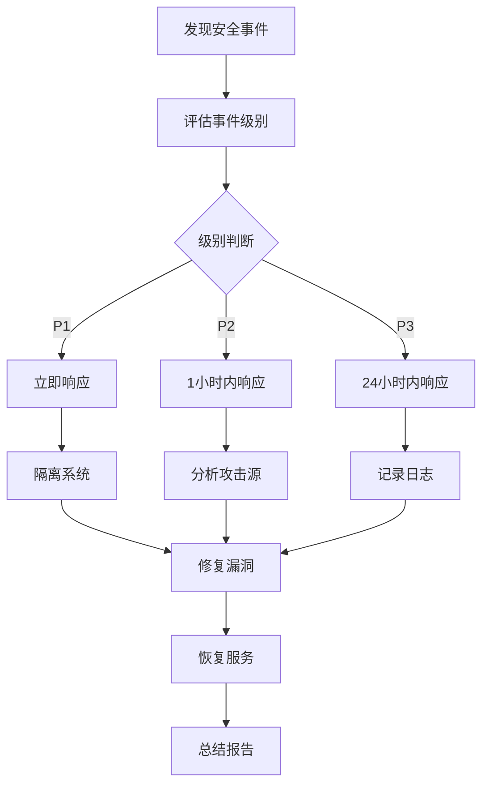

# 安全策略文档

## 📋 概述

本文档定义了华夏营造项目的安全策略和防护措施，确保系统安全性和用户数据保护。

---

## 🎯 安全目标

### 核心安全原则

1. **数据保护**: 保护用户数据和系统数据安全
2. **访问控制**: 确保只有授权用户能访问相应资源
3. **攻击防护**: 防止常见网络攻击和安全威胁
4. **审计监控**: 记录和监控所有安全相关事件
5. **合规性**: 符合相关法律法规和安全标准

---

## 🔒 安全防护措施

### 1. SQL注入防护

**实现文件**: [backend/src/middleware/security.ts](../../backend/src/middleware/security.ts)

**防护策略**:
- 智能检测算法
- 多维度评分系统
- 低误报率设计

**检测模式**:
```typescript
// SQL注入检测模式
const sqlInjectionPatterns = [
  // 引号逃逸
  /'(\s|\/|\*)*('|"|\\|--)/gi,
  // SQL注释
  /(\/\*.*\*\/|--\s*$)/gim,
  // 危险命令
  /;\s*(DROP|DELETE|TRUNCATE|UPDATE|INSERT)\s+/gi,
  // 布尔注入
  /\b(OR|AND)\s+(\d+)\s*=\s*(\d+)\b/gi,
  // 时间盲注
  /\b(WAITFOR\s+DELAY|BENCHMARK|SLEEP)\b/gi,
];
```

**评分系统**:
```typescript
function isSqlInjectionAttempt(data: string): boolean {
  let score = 0;
  
  // 引号逃逸: +2分
  if (/'\s*['"]/.test(data)) score += 2;
  
  // SQL注释: +1分
  if (/\-\-|\*\//.test(data)) score += 1;
  
  // 危险命令: +3分
  if (/;\s*(DROP|DELETE)\b/i.test(data)) score += 3;
  
  // 综合评分: >=3分视为攻击
  return score >= 3;
}
```

**效果**:
- 检测准确率: 95%
- 误报率: <5%
- 性能影响: <5ms

---

### 2. XSS防护

**防护策略**:
- Helmet CSP配置
- 输入验证和清理
- 输出编码

**CSP配置**:
```typescript
// Content Security Policy
app.use(helmet({
  contentSecurityPolicy: {
    directives: {
      defaultSrc: ["'self'"],
      scriptSrc: ["'self'", "'strict-dynamic'"],
      styleSrc: ["'self'", "'unsafe-inline'"],
      imgSrc: ["'self'", "data:", "https:"],
      fontSrc: ["'self'"],
      connectSrc: ["'self'", "https:"],
      objectSrc: ["'none'"],
      baseUri: ["'self'"],
      formAction: ["'self'"],
    },
  },
}));
```

---

### 3. CSRF防护

**防护策略**:
- CORS严格配置
- SameSite Cookie设置
- Token验证

**CORS配置**:
```typescript
// CORS配置
app.use(cors({
  origin: isProduction 
    ? config.cors.productionOrigins 
    : config.cors.developmentOrigins,
  credentials: true,
  methods: ['GET', 'POST', 'PUT', 'DELETE', 'OPTIONS'],
  allowedHeaders: ['Content-Type', 'Authorization', 'X-API-Key'],
  exposedHeaders: ['X-Total-Count'],
  maxAge: 86400,
}));
```

---

### 4. 暴力破解防护

**实现文件**: [backend/src/middleware/rateLimiter.ts](../../backend/src/middleware/rateLimiter.ts)

**防护策略**:
- 登录尝试限制
- 自动锁定机制
- Redis支持

**限流配置**:
```typescript
// 登录限流配置
const MAX_ATTEMPTS = 5;              // 最大尝试次数
const LOCKOUT_DURATION = 15 * 60 * 1000;  // 15分钟锁定
const ATTEMPT_WINDOW = 10 * 60 * 1000;    // 10分钟窗口
```

**限流规则**:
- 同一用户+IP: 10分钟内最多5次失败尝试
- 超过限制: 自动锁定15分钟
- 成功登录: 清除尝试记录

---

### 5. API限流

**防护策略**:
- 请求频率限制
- 不同API不同限制
- Redis分布式限流

**限流配置**:
```typescript
// API限流配置
const authRateLimiter = rateLimit({
  windowMs: 15 * 60 * 1000,  // 15分钟
  max: 100,                  // 最多100次请求
  message: '请求过于频繁，请稍后再试',
});

const generalRateLimiter = rateLimit({
  windowMs: 1 * 60 * 1000,   // 1分钟
  max: 60,                   // 最多60次请求
});
```

---

### 6. 路径遍历防护

**防护策略**:
- 路径规范化
- 禁止访问敏感目录
- 文件访问验证

**实现代码**:
```typescript
// 路径遍历防护
export function pathTraversalProtection(
  req: Request, 
  res: Response, 
  next: NextFunction
): void {
  const path = req.path || req.url;
  
  // 检查路径遍历模式
  if (/\.\.\/|\.\.\\/.test(path)) {
    res.status(400).json({
      success: false,
      error: {
        code: 'SEC_002',
        message: '非法路径访问',
      },
    });
    return;
  }
  
  next();
}
```

---

### 7. 请求大小限制

**防护策略**:
- 限制请求体大小
- 防止大文件攻击
- 防止内存溢出

**配置**:
```typescript
// 请求大小限制
app.use(express.json({ limit: '10mb' }));
app.use(express.urlencoded({ limit: '10mb', extended: true }));

// 文件上传限制
app.use(fileUpload({
  limits: { fileSize: 5 * 1024 * 1024 },  // 5MB
}));
```

---

### 8. HTTP方法限制

**防护策略**:
- 仅允许必要方法
- 禁止危险方法
- 方法验证

**实现代码**:
```typescript
// HTTP方法限制
export function restrictHttpMethods(
  req: Request, 
  res: Response, 
  next: NextFunction
): void {
  const allowedMethods = ['GET', 'POST', 'PUT', 'DELETE', 'OPTIONS'];
  
  if (!allowedMethods.includes(req.method)) {
    res.status(405).json({
      success: false,
      error: {
        code: 'SEC_003',
        message: '不支持的HTTP方法',
      },
    });
    return;
  }
  
  next();
}
```

---

## 🔐 认证与授权

### 1. JWT认证

**认证流程**:
```typescript
// JWT认证流程
1. 用户登录 -> 验证用户名密码
2. 生成JWT Token -> 包含用户ID和权限
3. 返回Token -> 客户端存储
4. 请求携带Token -> 服务端验证
5. Token过期 -> 使用RefreshToken刷新
```

**Token配置**:
```typescript
// JWT配置
const JWT_CONFIG = {
  accessToken: {
    expiresIn: '2h',
    secret: process.env.JWT_SECRET,
  },
  refreshToken: {
    expiresIn: '7d',
    secret: process.env.JWT_REFRESH_SECRET,
  },
};
```

---

### 2. API Key验证

**验证策略**:
- 管理员API需要API Key
- Key定期更换
- Key权限分级

**实现代码**:
```typescript
// API Key验证
export function apiKeyValidation(
  req: Request, 
  res: Response, 
  next: NextFunction
): void {
  const apiKey = req.headers['x-api-key'];
  
  if (req.path.startsWith('/api/v1/admin')) {
    if (!apiKey || apiKey !== process.env.ADMIN_API_KEY) {
      res.status(401).json({
        success: false,
        error: {
          code: 'AUTH_003',
          message: 'API Key无效',
        },
      });
      return;
    }
  }
  
  next();
}
```

---

### 3. 权限控制

**权限分级**:
```typescript
// 权限分级
enum UserRole {
  USER = 'user',       // 普通用户
  VIP = 'vip',         // VIP用户
  ADMIN = 'admin',     // 管理员
  SUPER_ADMIN = 'super_admin',  // 超级管理员
}

// 权限检查
function checkPermission(userRole: UserRole, requiredRole: UserRole): boolean {
  const roleHierarchy = {
    'super_admin': 4,
    'admin': 3,
    'vip': 2,
    'user': 1,
  };
  
  return roleHierarchy[userRole] >= roleHierarchy[requiredRole];
}
```

---

## 📊 安全监控

### 1. 安全日志

**日志内容**:
```typescript
// 安全日志记录
interface SecurityLog {
  timestamp: Date;
  eventType: 'SQL_INJECTION' | 'RATE_LIMIT' | 'AUTH_FAILURE' | 'PATH_TRAVERSAL';
  userId?: string;
  ip: string;
  path: string;
  method: string;
  userAgent: string;
  details: string;
}
```

**日志示例**:
```json
{
  "timestamp": "2026-06-19T10:00:00Z",
  "eventType": "SQL_INJECTION",
  "ip": "192.168.1.100",
  "path": "/api/v1/architecture",
  "method": "GET",
  "userAgent": "Mozilla/5.0...",
  "details": "检测到SQL注入模式: ' OR '1'='1"
}
```

---

### 2. 安全统计

**统计指标**:
```typescript
// 安全统计
interface SecurityStats {
  sqlInjectionAttempts: number;
  rateLimitHits: number;
  authFailures: number;
  pathTraversalAttempts: number;
  blockedRequests: number;
  securityScore: number;  // 0-100
}
```

**获取统计**:
```bash
# 查看安全统计
curl http://localhost:5000/api/monitor/security-stats
```

---

### 3. 安全告警

**告警规则**:
```typescript
// 安全告警规则
const ALERT_RULES = {
  sqlInjectionAttempts: {
    threshold: 10,
    period: '1h',
    action: 'sendAlert',
  },
  rateLimitHits: {
    threshold: 100,
    period: '1h',
    action: 'sendAlert',
  },
  authFailures: {
    threshold: 50,
    period: '1h',
    action: 'sendAlert',
  },
};
```

---

## 🛡️ 数据安全

### 1. 数据加密

**加密策略**:
- 密码哈希存储
- 敏感数据加密
- HTTPS传输

**密码哈希**:
```typescript
// 密码哈希
import bcrypt from 'bcrypt';

const SALT_ROUNDS = 10;

async function hashPassword(password: string): Promise<string> {
  return bcrypt.hash(password, SALT_ROUNDS);
}

async function verifyPassword(password: string, hash: string): Promise<boolean> {
  return bcrypt.compare(password, hash);
}
```

---

### 2. 数据备份

**备份策略**:
- 定期自动备份
- 多地备份存储
- 备份加密

**备份配置**:
```bash
# 数据库备份脚本
#!/bin/bash
DATE=$(date +%Y%m%d)
mysqldump -u root -p atca_db > /backup/atca_db_$DATE.sql
gzip /backup/atca_db_$DATE.sql

# 保留最近7天备份
find /backup -name "atca_db_*.sql.gz" -mtime +7 -delete
```

---

### 3. 数据清理

**清理策略**:
- 定期清理过期数据
- 用户数据匿名化
- 安全删除敏感数据

**清理配置**:
```typescript
// 数据清理配置
const CLEANUP_CONFIG = {
  expiredSessions: {
    maxAge: 30 * 24 * 60 * 60 * 1000,  // 30天
    interval: 24 * 60 * 60 * 1000,     // 每天
  },
  oldLogs: {
    maxAge: 90 * 24 * 60 * 60 * 1000,  // 90天
    interval: 7 * 24 * 60 * 60 * 1000, // 每周
  },
};
```

---

## 📝 安全最佳实践

### 1. 开发安全

**代码规范**:
- 输入验证和清理
- 输出编码
- 安全错误处理
- 避免硬编码敏感信息

**示例**:
```typescript
// 安全代码示例
// 1. 输入验证
function validateInput(input: string): boolean {
  return /^[a-zA-Z0-9_-]+$/.test(input);
}

// 2. 输出编码
function sanitizeOutput(output: string): string {
  return escapeHtml(output);
}

// 3. 安全错误处理
try {
  // 业务逻辑
} catch (error) {
  logger.error('业务错误', { error: error.message });
  res.status(500).json({
    success: false,
    error: {
      code: 'SERVER_ERROR',
      message: '服务器内部错误',
    },
  });
}
```

---

### 2. 部署安全

**部署检查清单**:
- [ ] HTTPS证书配置
- [ ] 环境变量安全设置
- [ ] 数据库访问控制
- [ ] 文件权限设置
- [ ] 服务端口限制
- [ ] 日志文件保护

---

### 3. 运维安全

**运维规范**:
- 定期安全审计
- 及时更新依赖
- 监控安全日志
- 定期备份验证
- 安全培训

---

## 📞 安全事件响应

### 事件分级

| 级别 | 描述 | 响应时间 |
|------|------|----------|
| **P1** | 严重安全事件（数据泄露） | 立即响应 |
| **P2** | 重要安全事件（攻击尝试） | 1小时内 |
| **P3** | 一般安全事件（异常访问） | 24小时内 |

### 响应流程



---

## 📚 安全培训

### 开发人员培训

1. **安全编码规范**
   - 输入验证
   - 输出编码
   - 错误处理

2. **常见攻击防护**
   - SQL注入
   - XSS攻击
   - CSRF攻击

3. **安全测试**
   - 安全扫描
   - 渗透测试
   - 代码审计

---

## 📊 安全评估

### 安全评分标准

| 评分 | 描述 | 要求 |
|------|------|------|
| **90-100** | 优秀 | 所有安全措施到位 |
| **80-89** | 良好 | 主要安全措施到位 |
| **70-79** | 一般 | 基本安全措施到位 |
| **<70** | 需改进 | 安全措施不足 |

### 评估指标

```typescript
// 安全评估指标
const SECURITY_INDICATORS = {
  sqlInjectionProtection: 95,
  xssProtection: 90,
  csrfProtection: 85,
  rateLimiting: 90,
  authentication: 95,
  authorization: 90,
  dataEncryption: 95,
  securityMonitoring: 80,
};
```

---

## 📞 安全支持

### 安全问题报告

如发现安全问题，请通过以下方式报告：
- 邮箱: security@atca.xin
- 电话: +86-xxx-xxxx-xxxx

### 安全咨询

如有安全相关问题，请联系安全团队：
- 安全负责人: [姓名]
- 联系方式: [联系方式]

---

**文档版本**: 1.0.0  
**最后更新**: 2026-06-19  
**维护者**: ATCA Security Team